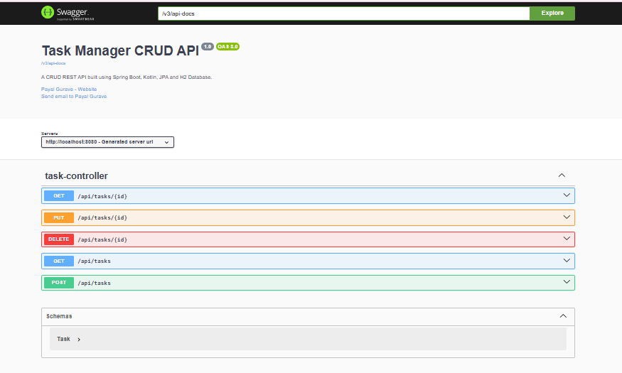

# 📋 Task Manager CRUD API

A RESTful Task Manager application built using **Spring Boot**, **Kotlin**, and **Spring Data JPA**. This project demonstrates a clean layered architecture with CRUD operations, validation, exception handling, interactive API documentation using Swagger, and an in-memory H2 database.

---

## 🚀 Features

- ✅ Create a Task
- ✅ Retrieve All Tasks
- ✅ Retrieve Task by ID
- ✅ Update Existing Task
- ✅ Delete Task
- ✅ Bean Validation
- ✅ Global Exception Handling
- ✅ Swagger/OpenAPI Documentation
- ✅ H2 In-Memory Database
- ✅ Layered Architecture (Controller → Service → Repository)

---

## 🛠 Tech Stack

| Technology | Version |
|------------|---------|
| Kotlin | 1.9 |
| Spring Boot | 3.3 |
| Spring Data JPA | Latest |
| Hibernate | ORM |
| H2 Database | In-Memory |
| Gradle | Build Tool |
| Swagger OpenAPI | API Documentation |

---

# 📂 Project Structure

```text
src
└── main
    ├── kotlin
    │   └── com.example.taskmanager
    │       ├── config
    │       ├── controller
    │       ├── entity
    │       ├── exception
    │       ├── repository
    │       ├── service
    │       └── TaskmanagerApplication.kt
    │
    └── resources
        └── application.properties
```

---

# 📷 Swagger UI

> Upload your screenshot inside a folder named **screenshots** and keep the filename as **swagger-ui.png**



---

# 📚 REST API Endpoints

| Method  | Endpoint          | Description       |
|---------|-------------------|-------------------|
| GET     | `/api/tasks`      | Get all tasks     |
| GET     | `/api/tasks/{id}` | Get task by ID    |
| POST    | `/api/tasks`      | Create a new task |
| PUT     | `/api/tasks/{id}` | Update a task     |
| DELETE  | `/api/tasks/{id}` | Delete a task     |

---

# ▶️ Running the Project

Clone the repository:

```bash
git clone https://github.com/payalgurave/task-manager-crud-api.git
```

Go to the project folder:

```bash
cd task-manager-crud-api
```

Run the application:

```bash
./gradlew bootRun
```

The application starts at:

```
http://localhost:8080
```

Swagger UI:

```
http://localhost:8080/swagger-ui/index.html
```

H2 Console:

```
http://localhost:8080/h2-console
```

---

# 🗄 Database

- H2 In-Memory Database
- Spring Data JPA
- Hibernate ORM

---

# 🔮 Future Enhancements

- MySQL Integration
- JWT Authentication
- Docker Support
- Unit Testing
- Pagination & Sorting
- Search API
- Spring Security
- Deployment to Render/Railway

---

# 👩‍💻 Author

**Payal Gurave**

GitHub: https://github.com/payalgurave

LinkedIn: https://www.linkedin.com/in/payal-gurave-9122602a1/

---

⭐ If you found this project useful, consider giving it a star!
